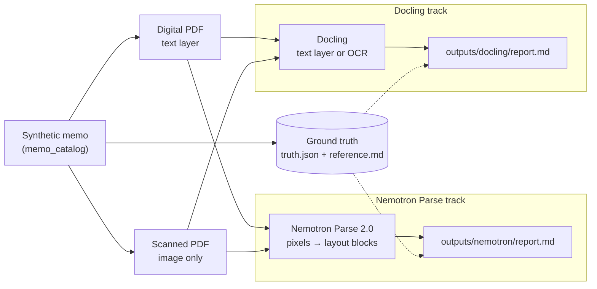
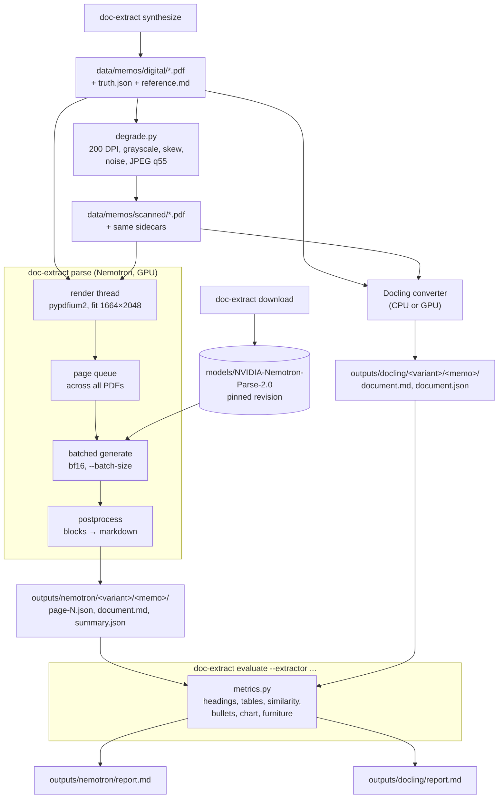
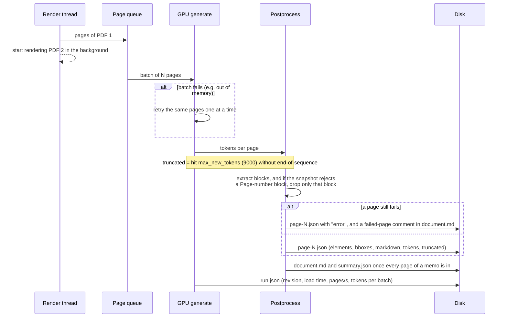

# Document extraction on DGX Spark

Turning investment-memo PDFs into structured markdown with two different tools, explored side by side but not raced against each other.

## Why

Investment memos mix prose, headed sections, holdings tables, charts, and repeated page furniture (header bands, disclaimers). We want markdown that keeps that structure so it can feed search, summaries, and data pipelines. Two tools take very different approaches to the problem:

- **[NVIDIA Nemotron Parse 2.0](https://huggingface.co/nvidia/NVIDIA-Nemotron-Parse-2.0)** is a vision-language model. It reads page *pixels* and writes layout blocks (class, bounding box, text) in reading order. It should not care whether a PDF has a text layer. The questions are how well it reads, how it handles tables, and what it costs to run locally on a DGX Spark.
- **[Docling](https://github.com/docling-project/docling)** is a layout-and-table pipeline. On a born-digital PDF it reads the embedded text layer, so the question is mostly about layout and table structure. On a scan it has to fall back to OCR, and we want to see what that costs.

This is **not a head-to-head**. Each extractor gets its own run and its own report. Both are scored against the same ground truth, so the numbers mean the same thing, but there is no combined ranking.

The memos are synthetic, which gives two things real documents can't:

1. **Exact ground truth.** Every heading, table row, bullet, and chart value that gets printed is also written to a sidecar.
2. **Digital and scanned versions of the same memo.** The scanned copy is image-only (no text layer), slightly skewed, noisy, and JPEG-compressed. Comparing a tool's two reports separates "reading the text" from "understanding the layout".



## How it works

Four commands, run in order. `evaluate` runs `parse` itself for any Nemotron output that is missing.



### Inside the Nemotron parse step

The model loads once. A single background thread renders PDFs (pdfium is not thread-safe, so every render stays on that thread) while the GPU generates for the current batch. A batch can hold pages from different memos.



## What gets measured

`metrics.py` scores each extractor's markdown against the memo's `truth.json` and `reference.md`. Text is normalized first: NFKC, ASCII dashes and quotes, markdown escapes like `\%` and `\$` removed, emphasis removed, case and whitespace folded.

| Metric | What it catches | What it misses |
| --- | --- | --- |
| **Headings** (as heading / right level) | Title and section names that come out as real `#` headings, and whether the level (h1 vs h2) is right | Headings written as bold paragraphs count as missing, even when the text is correct |
| **Table header / rows** | Every truth row must appear as one whole row of a parsed markdown table | Column order has to match, and merged or split cells count as a missed row |
| **Cells in tables** | Cells found *inside* any parsed table | Doesn't check which row or column a cell ended up in |
| **Text similarity** | Normalized Levenshtein similarity to `reference.md`, with page-marker comments and page furniture removed. Picks up reading order, dropped text, and hallucinated text | One number, so it doesn't say *what* went wrong. The chart is left out of the reference |
| **Bullets** | Each risk sentence, found anywhere | Doesn't check that it's formatted as a list item |
| **Chart labels / values** | Bar labels and values as whole words *outside* tables ("15" doesn't match "$15.20") | Labels that also appear in the prose count as found. "Water" and "Power" are in Lakefront's thesis, and "Retail" in Cedar and Pine's |
| **Page furniture** (kept) | Whether the repeated header band and disclaimer footer show up in the output | Recorded as a policy, not scored. Docling drops page furniture by default |

**Why whole rows instead of substrings?** The first version counted a table cell as found if its text appeared anywhere. In Lakefront, "Water" and "Power" appear in the thesis ("water, power, and toll facilities"), and sector names also appear as bar-chart labels. A completely broken table could still score 100%. Requiring the whole row, inside a table, removes that false credit. `tests/test_metrics.py` checks for exactly that case.

**Seconds.** Each report records its own timing: model load time separately, then seconds per memo (for Nemotron, the memo's share of its batches). The first Docling memo includes Docling's lazy model loading. Timings are for understanding each tool, not for comparing them.

## Setup

```bash
uv sync --group dev
uv run doc-extract download                      # Nemotron snapshot at the pinned revision
uv run doc-extract synthesize                    # digital + scanned memos, truth and reference sidecars
uv run doc-extract parse data/memos --batch-size 4
uv run doc-extract evaluate data/memos --extractor nemotron
uv run doc-extract evaluate data/memos --extractor docling
uv run doc-extract evaluate data/memos --extractor docling --docling-force-ocr
uv run pytest                                    # CPU-only, no model needed
```

- `--extractor all` (the default) writes both reports, one after the other.
- `--extractor docling` never imports torch or needs CUDA, so it runs on a laptop.
- `--docling-force-ocr` writes to `outputs/docling-force-ocr/`, so it doesn't overwrite the default Docling run.

### DGX Spark notes

- DGX Spark is an aarch64 machine with a GB10 GPU. The Nemotron Parse NIM container does not run on GB10, so inference uses Transformers in bfloat16 against a snapshot on local disk.
- Download the weights as your own user, not from a root container, so the model directory stays readable.
- PyTorch comes from the CUDA 13 wheel index to match the driver.
- `download` pins `MODEL_REVISION` in `paths.py`, because the snapshot is loaded with `trust_remote_code`. Change it on purpose, never by accident. `download` also skips the training-only auxiliary head file.

### Behind a TLS-inspecting proxy

If downloads from `us.aws.cdn.hf.co` fail with `CERTIFICATE_VERIFY_FAILED` (for example, Cisco Umbrella on the corporate network), the proxy's root CA is missing from the machine's trust store. Install that CA; don't disable verification. You can tell it's the proxy when `openssl s_client -connect us.aws.cdn.hf.co:443` shows an Umbrella issuer.

## Outputs

```
data/memos/digital/<memo>.pdf            born-digital memo (reportlab, byte-for-byte reproducible)
data/memos/digital/<memo>.truth.json     headings with levels, table, chart, bullets, page furniture
data/memos/digital/<memo>.reference.md   full expected body markdown in reading order
data/memos/scanned/...                   image-only copies with the same sidecars

outputs/nemotron/<variant>/<memo>/page-N.json   blocks, bboxes, markdown, generated_tokens, truncated, seconds
outputs/nemotron/<variant>/<memo>/document.md   pages joined with <!-- page N --> markers
outputs/nemotron/<variant>/<memo>/summary.json  pages, seconds, failed and truncated pages
outputs/nemotron/<variant>/run.json             revision, batch size, load seconds, pages/s, per-batch stats
outputs/nemotron/report.md, report.json

outputs/docling/<variant>/<memo>/document.md    Docling markdown export
outputs/docling/<variant>/<memo>/document.json  full DoclingDocument, for digging into misses
outputs/docling/report.md, report.json
```

`synthesize` writes the same bytes every time. Running it again should leave `git status` clean, and a test enforces that.

## Findings and open questions

*To fill in after the first runs on the Spark:* how each tool's digital and scanned reports differ, where tables break, how each handles heading levels, and Nemotron pages/s at batch sizes 1, 4, and 8.

Notes from the model repository (revision `b674206`):

- **Auxiliary prediction head.** It's a training-time multi-token head, kept "for future multi-token prediction research". Neither Transformers nor vLLM inference uses it, so skipping it costs no speed.
- **Attention.** The decoder config already uses SDPA. The C-RADIO encoder sets eager attention, so the code doesn't force an attention setting.
- **vLLM.** The model card lists vLLM v0.20–v0.26 as supported, including a patch for the tied output embeddings and logits processors that force table output. That's the next step for throughput (continuous batching) if HF `generate` is too slow. It hasn't been tried on aarch64/GB10 yet.

---

The memos, issuers, and figures are fictional and are not an offer to sell securities.
